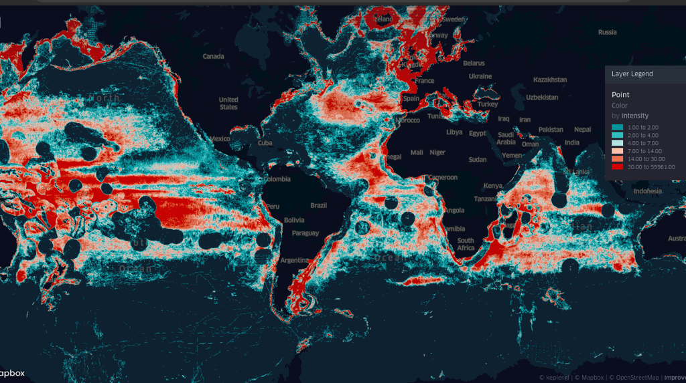
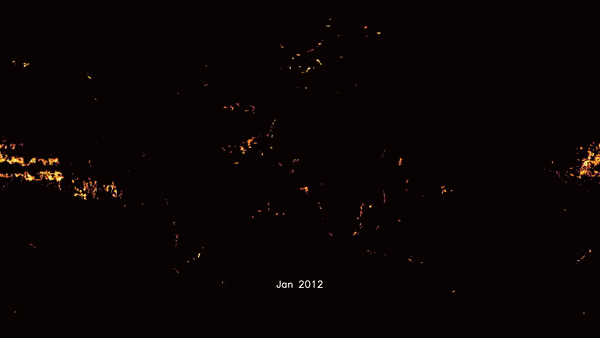

# Welcome to AI on the Beach
#### Studying ocean health by understanding the change of behavior in marine species due to human activity through collaboration with non-profits, their data sets, and the strength of our team members.

## What we're about
Our mission is to emotionally tie climate change through animal behavior in the ocean to help people understand how their behavior directly contributes to the current marine ecological crises. 

## How do we expect to meet our mission?
We are looking to better understand the major supply chains and help local groups shift their lanes away from areas where marine mammals are most vulnerable at being hit (see: Sri Lanka’s shipping lane changes due to Blue Whale feeding). As the shipping industry accounts for 3% of global greenhouse gas emissions, they are seeing pressure from startups with more energy efficient and time efficient vehicles. 

The goal is to create datasets paired with emotionally impactful visualizations that help companies understand their direct impact. First we create visuals aggregating the impact of an industry. Then we market the impact to the media to engage the public. Later, we educate the most influential industry leaders and we expect corporate violators to react quickly. This will allow those currently violating environmental standards to avoid a PR blowback as well as to create positive marketing for their brands. By targeting the most influential companies, we expect the rest of the industry to follow in suit. 

## Our research thus far
[You can access / stay up to date on our code and analysis here](https://github.com/aionthebeach/notebook)

Currently, our work is around overfishing and shark populations. We're looking to cross-analyze the effects of the policy changes on fishing compared to shark population resurgence. We do this by comparing shark data and intersecting fishing vessal data timeseries data.

##### Heat map of fishing zones by hours. Special thanks to Himanshu.

##### Fishing vessal timelapse

## Our team
We are always looking for new team members to join and help out!
[Meet the board!](./board)

## More information
Discord: [https://discord.gg/YMwgVPC](https://discord.gg/YMwgVPC)

General - [info@aionthebeach.com](mailto:info@aionthebeach.com)
